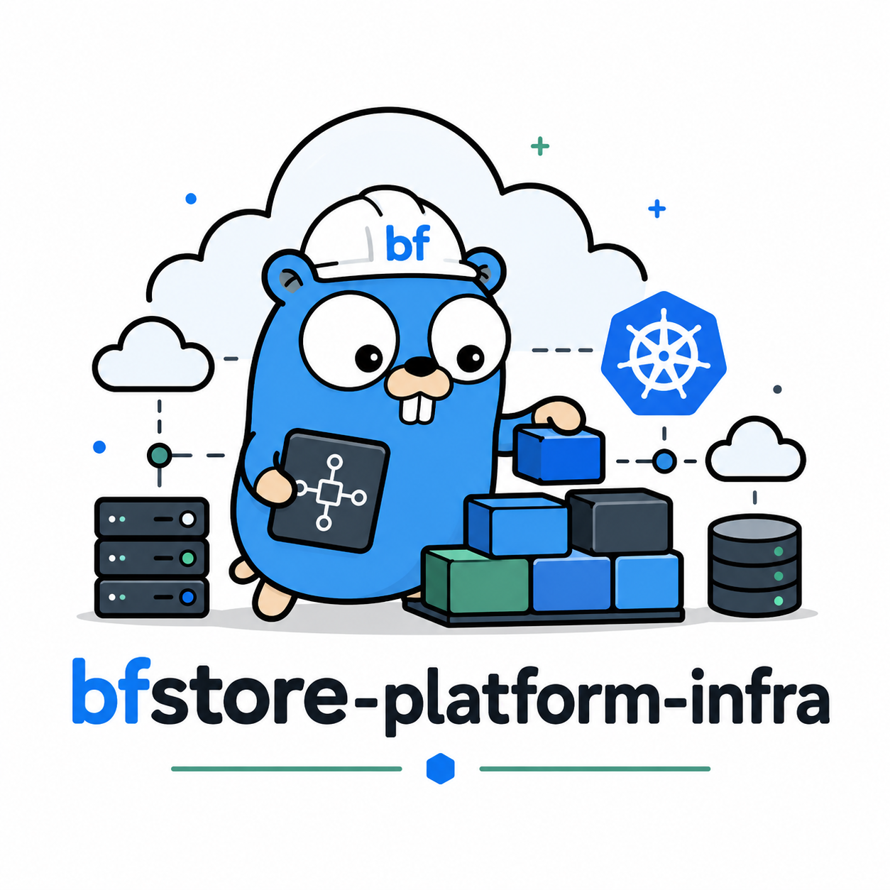

# bfstore Platform Infrastructure



Cloud infrastructure foundations for bfstore, including Kubernetes clusters, networking, managed data services, IAM, observability, and multi-cloud platform provisioning.

## Repository status

This repository is an early bfstore portfolio repository. It is currently being set up with initial structure, documentation, and direction before implementation work begins.

## Purpose

This repository will hold the infrastructure foundations required to run the bfstore platform in cloud and Kubernetes environments.

bfstore is a cloud-native ecommerce platform for developer-themed homeware. This repository is part of the wider bfstore portfolio and is intended to demonstrate senior platform engineering, DevSecOps, Kubernetes, cloud infrastructure, and developer experience capability.

## Scope

This repository will cover:

- Cloud networking and environment foundations
- Kubernetes cluster provisioning
- Managed database and event infrastructure foundations
- IAM, service identity, and least-privilege patterns
- Observability infrastructure foundations
- Environment-specific infrastructure definitions

  ## Out of scope

  This repository will not own:

- Application source code
- Service-level business logic
- Long-lived Kubernetes application manifests owned by GitOps
- Reusable Terraform modules intended to be shared across projects

    ## Suggested repository structure

- `envs/                 # Environment-specific infrastructure entrypoints`
- `clouds/               # Cloud-specific infrastructure experiments`
- `docs/                 # Architecture notes, diagrams, ADRs`
- `scripts/              # Local helper scripts`

  ## Initial roadmap

- [ ] Define the first local-to-cloud infrastructure target
- [ ] Create baseline network and Kubernetes cluster design
- [ ] Document environment naming and tagging standards
- [ ] Add security and least-privilege design notes
- [ ] Add observability infrastructure notes

    ## Engineering principles

    - Prefer simple, repeatable workflows over clever one-off scripts.
    - Document trade-offs clearly.
    - Keep security and operability visible from the beginning.
    - Design for local development first, then cloud deployment.
    - Treat naming, conventions, and structure as production foundations.

    ## Related bfstore repositories

    ```text
    bfstore
      Main ecommerce microservices platform.

    bfstore-platform-infra
      Cloud infrastructure foundations.

    bfstore-platform-gitops
      Kubernetes GitOps deployment state.

    bfstore-terraform-modules
      Reusable Terraform modules.

    bfstore-security-governance
      Security, compliance, policy, and governance controls.

    bfstore-developer-platform
      Golden paths, templates, and developer experience tooling.
    ```

    ## GitHub topics

    ```text
    platform-engineering terraform kubernetes cloud-infrastructure aws azure gcp devops devsecops infrastructure-as-code sre bfstore
    ```

    ## Practical rule

    Keep it boring where production matters.
